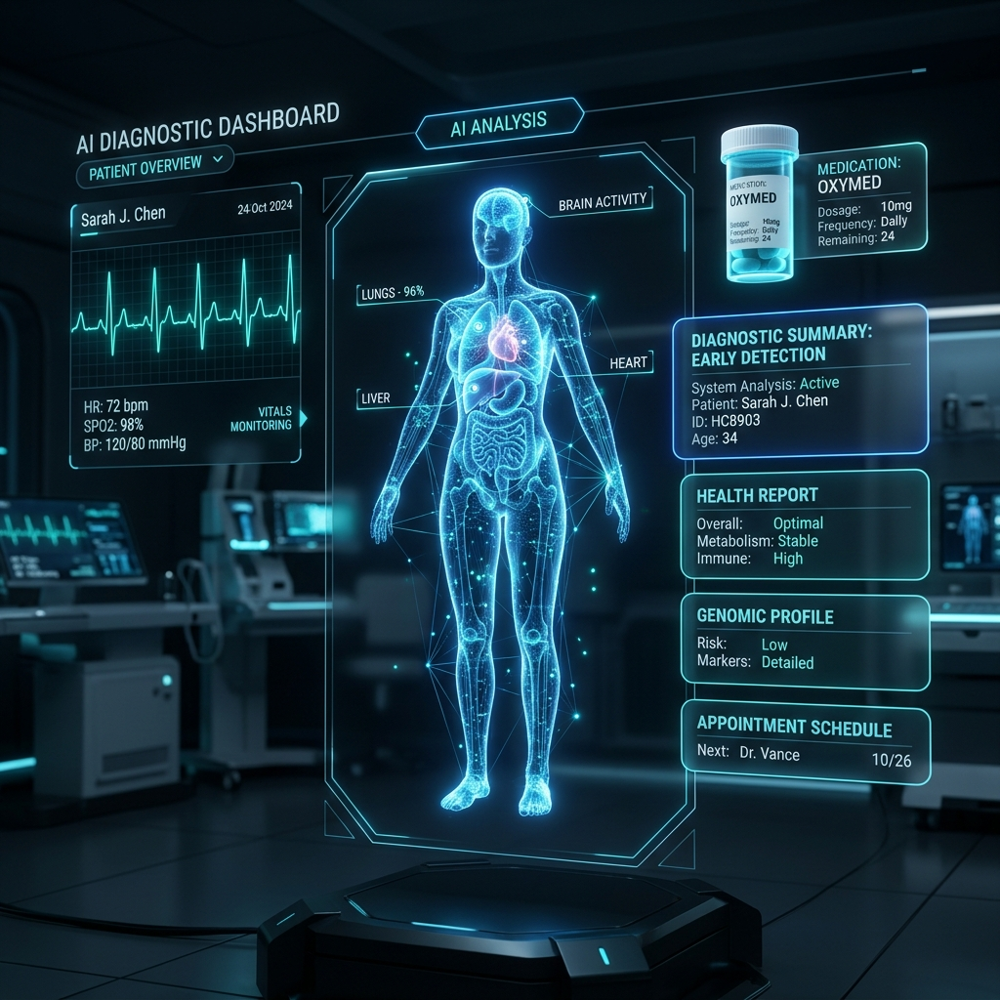
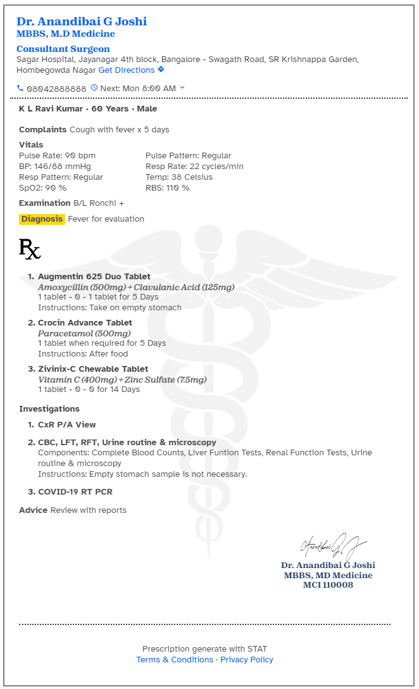

# 🏥 Healthify AI - Next-Gen AI-Powered Healthcare Platform



<p align="center">
  
  
  
  
  
</p>

---

## 🚀 Overview

**Healthify AI** is an intelligent, user-friendly healthcare web application designed to revolutionize individual medical management through artificial intelligence. By combining smart symptom prediction, optical character recognition (OCR) prescription processing, and an interactive AI health assistant, Healthify empowers users to take proactive control of their health.

---

## ✨ Key Features

### 🩺 1. AI Medical Symptom Predictor
- Input symptoms and receive instant preliminary diagnostic insights powered by machine learning algorithms with high accuracy.
- Detailed recommendations on potential conditions, precautions, and recommended medical specialists.

### 📜 2. Smart Prescription OCR Scanner
- Upload image scans or photos of hand-written and printed medical prescriptions.
- Automatically extracts medication names, dosage instructions, frequency, and duration into structured digital records.

### 💬 3. 24/7 AI Health Chatbot
- Integrated real-time medical assistant powered by Groq LLM API.
- Answers health queries, offers general medical advice, and guides users safely through symptom triage.

### 🎨 4. Interactive & Modern UI/UX
- **Glassmorphic Hero Engine**: Feature-packed hero section with floating metric badges, interactive tab switchers (3D Visuals, Walkthrough Video, and Live Symptom Simulator).
- **Dynamic 3D Animations**: Custom Three.js particle DNA helix rendering and interactive icon animations.
- **Healthcare News Aggregator**: Real-time integration with News API for current health and medical technology news.

---

## 📸 Screenshots

| Feature | Preview |
| :--- | :--- |
| **Interactive 3D Hero Dashboard** |  |
| **Prescription Scanner Demo** |  |

---

## 🛠️ Technology Stack

- **Frontend**: HTML5, Vanilla JavaScript (ES6+), Tailwind CSS, FontAwesome, AOS (Animate on Scroll)
- **3D Graphics & Animations**: Three.js, DotLottie / Lottie Runtime
- **Backend & Auth**: Appwrite Cloud SDK (Authentication, Databases, Google OAuth)
- **AI Models & APIs**: Groq API (GPT-OSS / LLaMA Models), News API
- **Deployment & Server**: Node.js, `serve`

---

## 📦 Installation & Setup

1. **Clone the Repository**:
   ```bash
   git clone https://github.com/aryann-tyagi/Healthify-AI.git
   cd Healthify-AI
   ```

2. **Install Dependencies**:
   ```bash
   cd public
   npm install
   ```

3. **Run Local Server**:
   ```bash
   npx serve -l 3000 public
   ```
   Open `http://localhost:3000` in your web browser.

---

## 🤝 Contributing

Contributions, issues, and feature requests are welcome! Feel free to check out the [Issues page](https://github.com/aryann-tyagi/Healthify-AI/issues).

---

## 📄 License

Distributed under the MIT License. See `LICENSE` for more information.

<p align="center">Made with ❤️ for better healthcare accessibility.</p>
